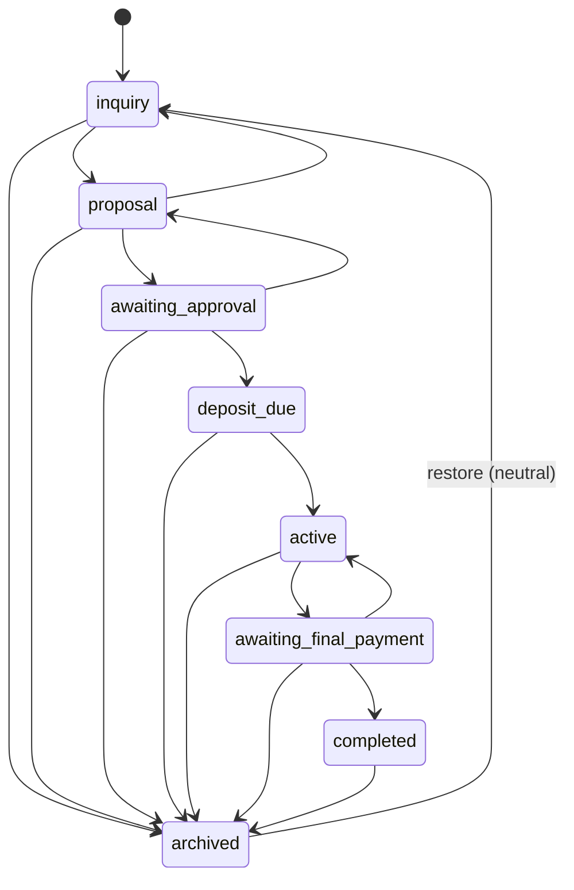

# Studio OS — Project Management (Phase 7)

**Status:** Accepted  
**Related:** [clients.md](./clients.md), [studio-auth.md](./studio-auth.md), [studio-database.md](./studio-database.md)

## Data model

| Table / column | Role |
| --- | --- |
| `projects` | Client-scoped engagement: scope, deliverables, pricing, dates, status |
| `projects.status_before_archive` | Audit metadata captured on archive (Phase 7 restore is neutral) |
| `settings` | Defaults: `default_currency`, `default_tax_bps`, `default_deposit_bps` |
| `activity_logs` | `project.*` actions |

Project price is **not** revenue. Lifetime revenue remains payment-based (Phase 6).

## Project ↔ client

- Every project requires `client_id`.
- Create/update validates UUID + client exists + RLS-visible.
- Active clients only for new projects; edit may keep an already-linked archived client.
- Client detail lists related projects (read-only summary + links). Archiving a client does **not** cascade-archive projects.

## Lifecycle statuses

Persisted enum `project_status`:

`inquiry` → `proposal` → `awaiting_approval` → `deposit_due` → `active` → `awaiting_final_payment` → `completed` → `archived`



### Allowed manual transitions

Centralized in `src/lib/projects/workflow.ts` and mirrored in RPC `transition_project`.

| From | To |
| --- | --- |
| inquiry | proposal, archived |
| proposal | awaiting_approval, inquiry, archived |
| awaiting_approval | deposit_due, proposal, archived |
| deposit_due | active, archived |
| active | awaiting_final_payment, archived |
| awaiting_final_payment | completed, active, archived |
| completed | archived |
| archived | inquiry (restore) |

Forbidden examples: `inquiry → completed`, `deposit_due → proposal`, `completed → active`.

### Automatic transitions (deferred)

Later phases must call the same transition service / RPC:

| Event | Transition | Phase |
| --- | --- | --- |
| Proposal accepted | `awaiting_approval` → `deposit_due` | 8 / 10 |
| Deposit paid | `deposit_due` → `active` | 11 |
| Final invoice generated | `active` → `awaiting_final_payment` | 9 |
| Final invoice paid | `awaiting_final_payment` → `completed` | 11 |

## Money model

| Field | Representation |
| --- | --- |
| `project_price_minor` | Integer minor units (e.g. $8,000.00 CAD → `800000`) |
| `currency` | ISO enum (`CAD`, `USD`) |
| `tax_bps` | Basis points (13% → `1300`) |
| `deposit_bps` | Basis points (50% → `5000`), `0..10000` |

Parsing uses `src/lib/money/parse.ts` (decimal string → minor units; no naive `parseFloat * 100`).

**Deposit preview (informational):**  
`deposit_base = trunc(price_minor * deposit_bps / 10000)`  
Remainder = price − deposit base. Tax is **not** applied here; invoice engine (Phase 9) owns authoritative rounding.

Do **not** persist calculated invoice totals on the project row.

### Settings defaults

On create, defaults come from `settings` (id=1) when present:

- currency → `default_currency` else **CAD**
- tax → `default_tax_bps` else **0** (do not invent a provincial rate)
- deposit → `default_deposit_bps` else **5000** (50%)

## Archive / restore

- Soft archive: `status = archived`, `archived_at = now()`, `status_before_archive = previous`.
- No cascade deletes; proposals/invoices/payments remain.
- Default list filter excludes archived (`status=operational`).
- **Restore strategy (Phase 7):** always restore to **`inquiry`** (documented neutral state). `status_before_archive` is retained as audit metadata only — not used for automatic restore target, to avoid unreliable reconstruction across future automation.
- UI warns before archiving `deposit_due`, `active`, or `awaiting_final_payment`.
- Hard delete is not exposed in Studio UI.

## Concurrency

| Operation | Strategy |
| --- | --- |
| Edit | `expectedUpdatedAt` compared to row `updated_at`; conflict message on stale write |
| Status transition | RPC `transition_project` with `FOR UPDATE` + `expected_status` check; conflict if stale |

Status never changes through the general update allowlist — only via `transitionProject`.

## Permissions / RLS

| Permission | Access |
| --- | --- |
| `studio.projects.read` | List + detail |
| `studio.projects.write` | Create, edit, transition, archive/restore |

Request-scoped user Supabase client only. RLS remains defense in depth. RPC is **SECURITY INVOKER**.

## Activity events

- `project.created`
- `project.updated` (changed field names, not note bodies)
- `project.status_changed` (`metadata.from` / `metadata.to`)
- `project.archived`
- `project.restored`

## Routes

| Path | Purpose |
| --- | --- |
| `/admin/projects` | Search, status filter, sort, pagination (25/page) |
| `/admin/projects/new` | Create (`?client=<uuid>` preselect when authorized) |
| `/admin/projects/[id]` | Detail, workflow actions, placeholders for proposals/invoices |
| `/admin/projects/[id]/edit` | Edit allowlisted fields (status read-only via workflow) |

## Library layout

```
src/lib/projects/
  queries.ts
  mutations.ts
  validation.ts
  workflow.ts
  types.ts
  form-values.ts
src/lib/money/parse.ts
```

## Deferred

- Proposal builder / templates / versions — Phase 8
- Invoice engine — Phase 9
- Client acceptance — Phase 10
- Stripe — Phase 11
- Email / PDFs / full reporting — Phases 12–14
