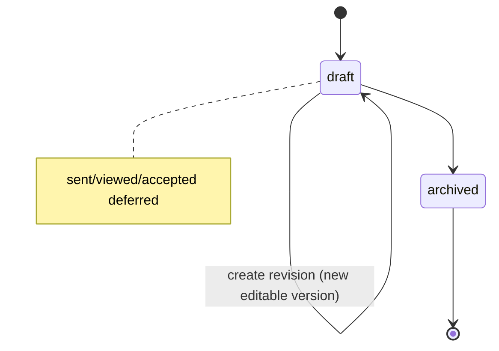

# Studio OS — Proposal Management (Phase 8)

**Status:** Accepted  
**Related:** [projects.md](./projects.md), [clients.md](./clients.md), [studio-database.md](./studio-database.md)

## Proposal vs Version

| Record | Role |
| --- | --- |
| `proposals` | Lifecycle container, number, client/project FKs, `current_version_id`, status |
| `proposal_versions` | Immutable-capable content + financial snapshot |
| `proposal_items` | Line items belonging to exactly one version |

Historical documents always render from a **version snapshot**, never from live Project/Client rows.

## Lifecycle / delivery boundary

Parent statuses (Phase 4 enum): `draft`, `sent`, `viewed`, `accepted`, `changes_requested`, `expired`, `declined`, `archived`.

**Phase 8 operates primarily on `draft` (+ `archived`).**

Finalization:

- Sets `proposal_versions.is_immutable = true` and `finalized_at = now()`
- Keeps parent `proposals.status = draft`
- Does **not** set `sent_at` or `status = sent`

`sent` / delivery belongs to **Phase 12**.  
Public acceptance belongs to **Phase 10**.

## Templates

- CRUD under `/admin/templates` (`studio.templates.manage`)
- Applying a template **copies** fields into the new Proposal Version
- Later template edits never mutate historical proposals
- At most one active default (`set_default_proposal_template` RPC + unique partial index)
- Archive clears default and hides from normal pickers

## Pricing

Shared module: `src/lib/finance/calculations.ts`

1. Line `amount_minor = trunc(quantity_scaled × rate_minor / 10_000)`
2. Subtotal = sum of selected lines (optional unselected excluded)
3. Discount clamped to `[0, subtotal]`
4. Taxable base = subtotal − discount
5. `tax_minor = round_half_up(taxable_base × tax_bps / 10_000)`
6. Total = taxable base + tax

Payment schedule text is snapshotted on the version (defaults from project deposit %).

## Versioning

- Create → Version 1 (editable)
- Finalize → Version N immutable (parent stays draft)
- Revision RPC → Version N+1 editable copy; source untouched; concurrency-safe `MAX(version_number)+1` under row lock

Optimistic concurrency on draft save via proposal `updated_at`.

## Client / Project integration

- Create from `/admin/proposals/new?project=<uuid>` (authorized)
- Prefill from project + client + primary contact + optional default template
- Version stores `client_display_name`, contact snapshot, `project_name`, `tax_bps`, `deposit_bps`
- First proposal on an `inquiry` project may transition `inquiry → proposal` via Phase 7 workflow service
- Project/Client detail pages list related proposals (summary only)

## Authorization

| Permission | Use |
| --- | --- |
| `studio.proposals.read` | List, detail, preview, versions |
| `studio.proposals.write` | Create, edit draft, finalize, revise, archive |
| `studio.templates.manage` | Template CRUD / default / archive |

RLS + request-scoped user client. No public tokens. No service-key CRUD.

## Routes

| Path | Purpose |
| --- | --- |
| `/admin/proposals` | List |
| `/admin/proposals/new` | Create from project |
| `/admin/proposals/[id]` | Detail / actions |
| `/admin/proposals/[id]/edit` | Draft editor |
| `/admin/proposals/[id]/preview` | Authenticated preview |
| `/admin/proposals/[id]/versions/[versionId]` | Historical version |
| `/admin/templates` | Templates |

## Deferred

- Invoice engine — Phase 9  
- Public `/proposal/[token]` + acceptance — Phase 10  
- Stripe — Phase 11  
- Email send / reminders — Phase 12  
- PDF — Phase 13  
- Dashboard reporting — Phase 14
