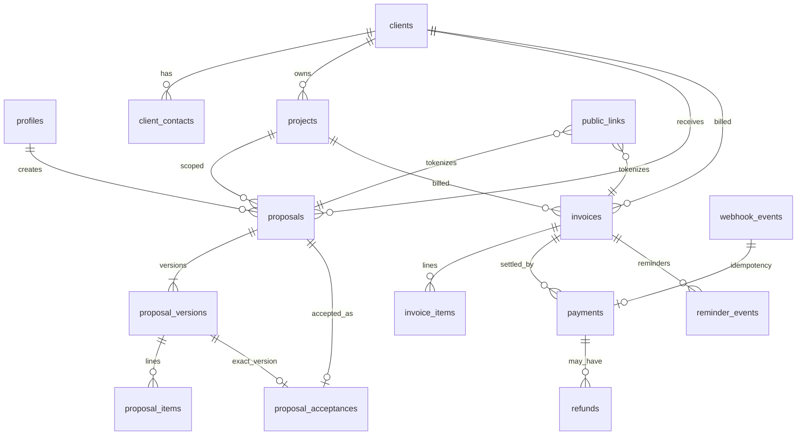

# Studio OS — Database Model (Phase 4)

**Status:** Accepted  
**Related:** [supabase.md](./supabase.md), [studio-os.md](./studio-os.md)

## Migration boundaries

| Path | Tool | Purpose |
| --- | --- | --- |
| `/migrations` | Wrangler D1 (`npm run db:*`) | Public contact leads |
| `/supabase/migrations` | Supabase/Postgres (`npm run supabase:*`) | Studio OS business data |

Never cross tools. D1 `0001_init.sql` is untouched.

## ER overview



Core flow:

Client → Project → Proposal → Proposal Version → Acceptance → Invoice → Payment → Refund

Operational: Email Logs, Activity Logs, Reminder Events, Documents, Webhook Events, Settings, Number Counters.

## Money model

| Concept | Representation |
| --- | --- |
| Currency | `currency_code` enum (`CAD`, `USD`); default `CAD` |
| Money | `bigint` **minor units** (CAD cents). Example: `$8,000.00` → `800000` |
| Tax / deposit | **basis points** (`integer`). `50%` → `5000`, `13%` → `1300` |
| Arithmetic | Never `float` / `double` / `real` for money |

Constraints enforce non-negative amounts and `0 <= deposit_bps <= 10000`.

Invoice invariant: `balance_due_minor = total_minor - amount_paid_minor`.

## Document numbering

Function: `public.next_document_number(counter_type, prefix, year)`

- Atomic upsert + increment on `number_counters` (never `COUNT(*)+1`)
- `SECURITY DEFINER` with fixed `search_path`
- Formats:
  - Invoices: `CXS-2026-001` (prefix from settings default `CXS`)
  - Proposals: `CXS-P-2026-001` (prefix default `CXS-P`)
- Padding at least 3 digits; values ≥ 1000 are not truncated
- Separate counters per `(type, year, prefix)`
- Void/deleted numbers are not reused (monotonic `current_value`)

## Immutability

### Proposal versions

- `proposal_versions.is_immutable`
- Set `true` when parent proposal status becomes `sent` / `viewed` / `accepted`
- Triggers block UPDATE/DELETE on immutable versions and their items
- Corrections require a **new version**

### Invoices

- Draft: editable financials + items
- Non-draft: financial snapshot columns locked; items locked
- Still mutable: `status`, `amount_paid_minor`, `balance_due_minor`, `sent_at`, `paid_at`, `voided_at`
- Non-draft invoices cannot be DELETE’d (void instead)
- Client/project FKs use `ON DELETE RESTRICT` to protect history

### Activity logs

Append-only (UPDATE/DELETE blocked).

## Public links

`public_links.token_hash` stores a cryptographic hash only. Plaintext tokens are generated in server code and never persisted. No anonymous PostgREST policies on proposals/invoices.

## Authorization (RLS)

| Actor | Access |
| --- | --- |
| `anon` | No policies → cannot read business tables |
| Authenticated non-member | `is_studio_user()` false → no rows |
| Suspended profile | Not active → no business access |
| Active staff/owner/admin | SELECT/INSERT/UPDATE per table policies |
| Owner/admin | Extra rights (settings update, refunds, webhooks, public_links writes) |
| `service_role` | Trusted system/webhook path; not for ordinary UI requests |

Helpers:

- `is_studio_user()` / `is_studio_admin()` — `SECURITY DEFINER`, fixed `search_path`, execute granted to `authenticated` + `service_role` only

Membership table: `profiles` (`auth_user_id` → `auth.users`, roles `owner|admin|staff`, status `active|suspended`).

## Enum strategy

PostgreSQL `ENUM` types for closed status/role sets. Adding values requires `ALTER TYPE` migrations. Generated into `Database['public']['Enums']`.

## Cascade policy summary

| Relationship | On delete |
| --- | --- |
| profiles ← auth.users | CASCADE (auth identity removal) |
| client_contacts → clients | RESTRICT |
| projects → clients | RESTRICT |
| proposals/invoices/payments → clients/projects | RESTRICT (financial history) |
| proposal_versions → proposals | CASCADE (version owned by proposal) |
| proposal_items → versions | CASCADE |
| invoice_items → invoices | CASCADE (draft only deletable) |
| refunds → payments | RESTRICT |

## Local verification

```bash
npm run supabase:db:test          # apply migrations + constraint/RLS checks (system Postgres)
npm run supabase:types:from-pg    # regenerate database.types.ts from that DB
# With Docker:
npm run supabase:start && npm run supabase:db:reset && npm run supabase:types
```

## Deviations from the prompt inventory

None material. Tables match the expected inventory (21 base tables + helpers/views). Proposal number default format documented as `CXS-P-YYYY-NNN`.
